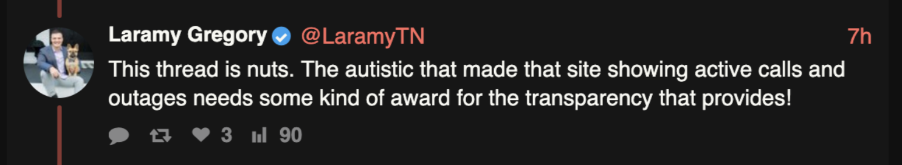

# NES Outage Status Checker

A web app to track Nashville Electric Service (NES) power outage status. Monitor your specific outage, view all active outages across the service area, and see historical trends.

**Live Site:** [nes-outage-checker.com](https://nes-outage-checker.com)

## My Award



## Notice

This is an unofficial community project. It uses publicly available NES outage data to provide a more user-friendly monitoring experience.

## Why?

During outages, the NES outage map shows affected areas but doesn't clearly indicate whether a technician has been assigned to your specific outage. This tool monitors your outage event and alerts you when the status changes, so you know help is on the way.

## Features

### Monitor Page
- **Track specific outages** by Event ID or address lookup
- **Browser notifications** when status changes
- **Sound alerts** for status updates
- **Multi-monitor support** - track up to 4 outages at once
- **Shareable URLs** - send your monitor config to others
- **Status history** - see how your outage status has changed
- **Crews Near Me map** - view NES crews working near your outages

### All Outages Page
- **View all active outages** across the NES service area
- **Filter by status** (Assigned/Unassigned) and affected customers
- **Sort options** - by status, duration, most affected, or recently updated
- **Map view** - see outages plotted geographically with color-coded markers
- **Chart view** - track metrics over time (affected customers, outage count, active crews)
- **Change history** - log of new outages, resolved outages, and status changes

### Both Pages
- **Auto-refresh** at configurable intervals
- **Light/dark mode** with theme toggle
- **Colorblind-friendly mode**
- **Keyboard shortcuts** for quick actions
- **Map style toggle** - dark, light, or aerial views
- **Offline detection** - banner when connection is lost

## How It Works

All data comes directly from the NES public API. We don't add, modify, or interpret any information - we just fetch it and display it in a more accessible format. See the [How It Works](https://nes-outage-checker.com/how-it-works.html) page for technical details.

## Data Source

This tool uses the public NES outage API:

```
https://utilisocial.io/datacapable/v2/p/NES/map/events
```

## Contributing

Contributions welcome! See the [contributors page](https://github.com/NeckBeardPrince/nes-outage-status-checker/graphs/contributors) for those who have helped improve this project.

## License

[The Unlicense](LICENSE) - Public Domain
