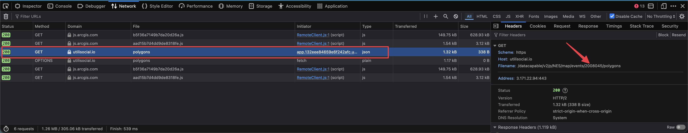

# NES Outage Status Checker

A terminal UI app to track Nashville Electric Service (NES) power outage repair status. Built with [Bubble Tea](https://github.com/charmbracelet/bubbletea) and [Lip Gloss](https://github.com/charmbracelet/lipgloss).

## My award


## Notice

This isn't an officially sanctioned app, and NES or their data provider might revoke or block this access. Though it's just using public data, so I don't see why they would.

## Why?

During outages, the NES outage map shows affected areas but doesn't clearly indicate whether a technician has been assigned to your specific outage. This tool monitors your outage event and alerts you when the status changes from "Unassigned" to "Assigned" (or any other status), so you know help is on the way.

## Features

- Real-time status monitoring with auto-refresh every 30 seconds
- Color-coded status display:
  - **Red**: Unassigned (no technician dispatched yet)
  - **Flashing Green**: Assigned (technician en route!)
- Shows outage details: affected customers, start time, last update, cause (if known)
- Manual refresh with `r` key
- Quit with `q` or `Esc`

## Finding Your Event ID

1. Go to [nespower.com/outages](https://www.nespower.com/outages/)
2. Open your browsers Dev Tools
3. Click on your outage marker on the map
4. Get event id.
   

## CLI Installation

### From source

Requires Go 1.21+

```bash
git clone https://github.com/yourusername/nes-outage-status-checker.git
cd nes-outage-status-checker
go build -o nes-outage-status-checker
```

## Usage

1. Find your outage event ID from the [NES Outage Map](https://www.nespower.com/outages/)
2. Run the checker with your event ID:

```bash
./nes-outage-status-checker <event-id>
```

Example:

```bash
./nes-outage-status-checker 1971637
```

## API

This tool uses the public NES outage API:

```
https://utilisocial.io/datacapable/v2/p/NES/map/events
```

## License

The Unlicense
